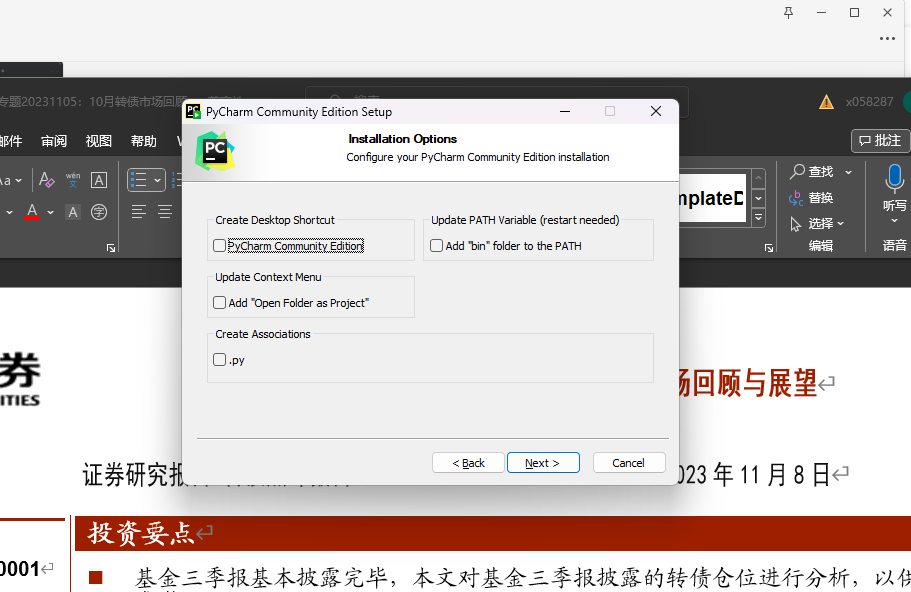
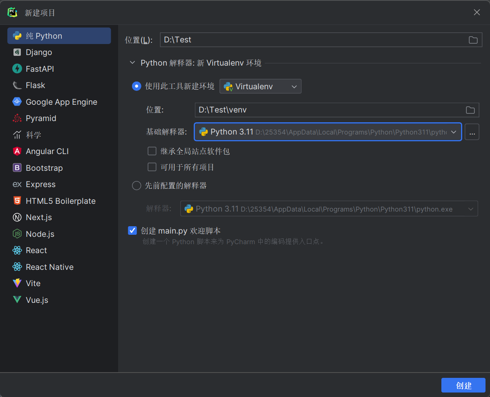
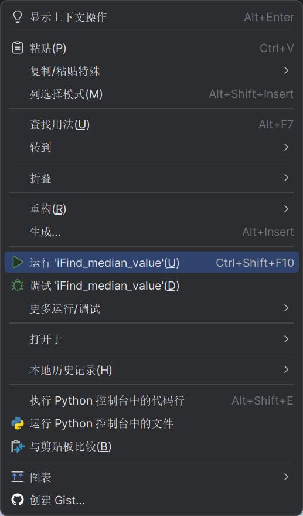

## Python环境配置

详细安装步骤参考[Python安装与环境配置超详细保姆级教程](https://blog.csdn.net/m0_57081622/article/details/127180996)

## iFind Python 环境配置

1. [点击下载](http://ft.10jqka.com.cn/index.php?c=index&a=download)同花顺数据接口
2. 第一次下载的用户，请您先打开文件夹内的SuperCommand并登录您的账号
3. 登录后，系统会要求您修复相关编程语言环境，请按照指示修复相关环境
4. 或在登录后点击工具中的环境设置选项，选中Python后点击确定按钮
5. 然后选中安装的Python路径，点击继续

## 安装Pycharm

1. [点击下载](https://www.jetbrains.com/pycharm/download/download-thanks.html?platform=windows&code=PCC)
2. 注意一定要勾选`Add "bin" folder to the PATH`


3. 其他步骤点击`next`即可

详细安装步骤[pycharm安装教程](https://blog.csdn.net/qq_44809707/article/details/122501118)

> 在PyCharm的设置->插件中可以安装中文插件

## 运行Python程序

1. 在PyCharm右上角点击文件->新建项目


2. 创建完成后，在当前目录下右键创建Python文件
3. 粘贴代码/[前往下载](https://github.com/ZhouBinxin/iFind/blob/master/iFind2.0.py)
```python
"""
使用提醒
在calculate_median函数中修改转换价值范围

Author：binxin
Date：2023/11/18 14:44
"""
import os
import numpy as np
import pandas as pd
from iFinDPy import *
import datetime


# 登录函数
def login(username, password):
    thsLogin = THS_iFinDLogin(username, password)
    if thsLogin != 0:
        print('登录失败')
    else:
        print('登录成功')


# 获取数据
def get_data(edate):
    get_str = 'edate=' + edate + ';zqlx=全部'
    data_p00868 = THS_DR('p00868', get_str, 'p00868_f027:Y,p00868_f022:Y', 'format:list')
    return data_p00868


# 保存数据到Excel
def save_to_excel(file_name, str_date, premium):
    if not os.path.exists(file_name):
        data = {"日期": [str_date], "转股溢价率%": [premium]}
        df = pd.DataFrame(data)
    else:
        df = pd.read_excel(file_name)
        new_data = pd.DataFrame({"日期": [str_date], "转股溢价率%": [premium]})
        df = pd.concat([df, new_data], ignore_index=True)

    df.to_excel(file_name, index=False)


# 计算中位数
def calculate_median(data):
    max_value = 101
    min_value = 99
    float_values = []

    data_f022 = data['p00868_f022']
    data_f027 = data['p00868_f027']

    for f027, f022 in zip(data_f027, data_f022):
        if '--' in f027 or '--' in f022:
            continue

        f027_value = float(f027)
        f022_value = float(f022)

        if min_value <= f027_value <= max_value:
            float_values.append(f022_value)

    return np.median(float_values) if float_values else None


# 获取数据 - 单日
def get_today_data():
    today = datetime.date.today()
    edate = today.strftime("%Y%m%d")
    return get_data(edate)


# 获取数据 - 区间
def get_interval_data(start_date, end_date):
    delta = datetime.timedelta(days=1)
    data_list = []

    while start_date <= end_date:
        edate = start_date.strftime("%Y%m%d")
        data = get_data(edate)
        if data.data is not None:
            data_list.append((start_date.strftime("%Y/%m/%d"), data))
        start_date += delta

    return data_list


# 主函数
def main():
    username = "zyzqsx112"
    password = "935b43"
    login(username, password)

    # 获取本日数据
    today_data = get_today_data()
    if today_data.data is not None:
        today_median = calculate_median(today_data.data[0]['table'])
        if today_median is not None:
            save_to_excel("转股溢价率记录(转换价值).xlsx", datetime.date.today().strftime("%Y/%m/%d"), today_median)

    # 获取区间时间内的数据
    # start_date = datetime.date(2023, 11, 1)
    # end_date = datetime.date(2023, 11, 18)
    # interval_data = get_interval_data(start_date, end_date)
    #
    # for date, data in interval_data:
    #     median_value = calculate_median(data.data[0]['table'])
    #     if median_value is not None:
    #         save_to_excel("转股溢价率记录(转换价值).xlsx", date, median_value)


if __name__ == '__main__':
    main()

```

4. 安装必要的第三方库(以下操作二选一)
	1. 将鼠标放在爆红的代码上，点击弹出的安装软件包选项
	2. 在命令行工具(win+R 然后输入cmd)中执行以下代码
	```bash
	# 安装 numpy
	pip install numpy

	# 安装 pandas
	pip install pandas
	```

> 安装过慢可以考虑更换国内源 [pycharm如何更换国内镜像源](https://blog.csdn.net/Zenglih/article/details/106975435)

```bash
# 安装 numpy，使用清华大学镜像源
pip install -i https://pypi.tuna.tsinghua.edu.cn/simple numpy

# 安装 pandas，使用阿里云镜像源
pip install -i https://mirrors.aliyun.com/pypi/simple pandas
```


5. 右键运行

## 程序相关

1. 获取本日数据和获取区间时间内的数据只能选其一，运行前需要注释另一部分代码
2. 修改转换价值范围
   1. 在calculate_median函数中修改max_value和min_value的值
   2. 修改`min_value < f027_value <= max_value`部分选择是否保留边界
   3. 例：(100，120]
	```python
	def calculate_median(data):
    max_value = 120
    min_value = 100
    float_values = []

    data_f022 = data['p00868_f022']
    data_f027 = data['p00868_f027']

    for f027, f022 in zip(data_f027, data_f022):
        if '--' in f027 or '--' in f022:
            continue

        f027_value = float(f027)
        f022_value = float(f022)

        if min_value < f027_value <= max_value:
            float_values.append(f022_value)

    return np.median(float_values) if float_values else None
	```